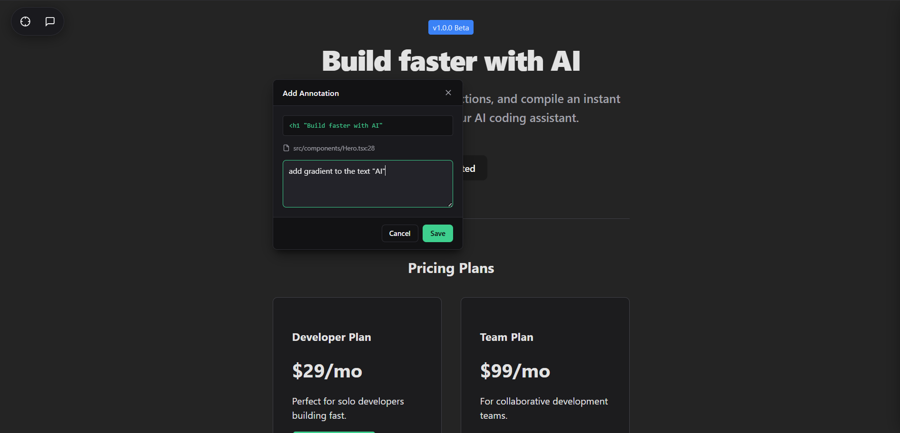
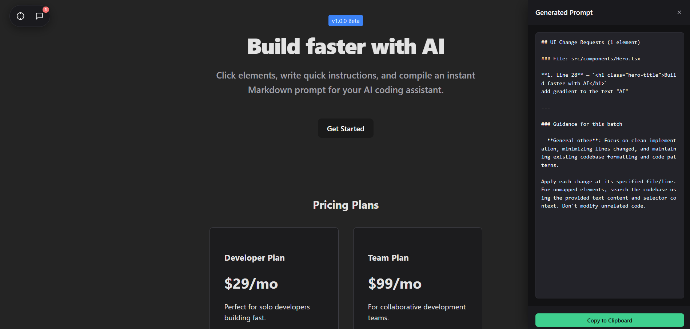

# Annoty

Annoty is an interactive developer overlay and CLI utility designed to bridge the gap between visual web interfaces and LLM-assisted code editors (such as Claude Code, Cursor, and the Antigravity CLI). 

By allowing developers to inspect and annotate DOM elements directly in the browser during local development, Annoty compiles visual feedback into structured, contextual Markdown prompts that map directly to the corresponding source code files and line numbers.

<p align="center">
  
</p>

<p align="center">
  
</p>


---

## Architectural Features


* **Visual DOM Inspection:** Enables element-level click detection and inline annotation overrides without disrupting application-level click handlers or page state.
* **AST-to-DOM Source Mapping:** Pairs with build plugins to traverse component Abstract Syntax Trees (AST) at compile time, injecting unique location attributes (`data-annoty-source`) onto rendered elements.
* **Multi-Tier Fallback Resolver:** Resolves source file and line mapping using a prioritized lookup hierarchy (React Fiber, Vue VNodes, Svelte metadata, Astro elements, manual mapping, or semantic CSS selectors).
* **DOM Sandbox Isolation:** Renders the inspector popup, sidebars, and control toggles inside an isolated Shadow DOM to ensure styles do not bleed into or inherit from the parent application.
* **Local-First Persistence:** Operates fully offline by default. All annotation states, historical prompt iterations, and group hierarchies reside in browser LocalStorage.
* **High-Throughput Batch Processing:** Supports simultaneous batch edits. Developers can queue and compile dozens of separate annotations (handling batches of 10+ elements at a time) into a single consolidated instructions prompt.
* **Cloud Sync Interface:** Supports session token configuration to seamlessly proxy read/write operations through a secure server-side API.

---

## Installation & Setup

Annoty requires Node.js v18.0.0+ (which includes native `fetch` support). You can choose to install the CLI globally on your system or execute commands on-demand.

> [!TIP]
> **Running the commands:**
> - **Global Installation:** If you installed the package globally via `npm install -g annoty-cli`, use `annoty <command>` (e.g., `annoty init`).
> - **On-Demand (npx):** If you prefer running it on-the-fly without global installation, use `npx annoty-cli <command>` (e.g., `npx annoty-cli init`). Do *not* run `npx annoty <command>` as `annoty` is not the registered package name on npm.

### Global Installation (Recommended)
Install the package globally to register the shorthand `annoty` binary on your path:

```bash
npm install -g annoty-cli
```

### On-Demand Runner
Execute commands directly without permanent installation:

```bash
npx annoty-cli <command>
```

---

## Integration Workflow

### 1. Project Initialization

Execute the initialization command from the root of your application directory:

```bash
# Using global installation:
annoty init

# Using on-demand runner:
npx annoty-cli init
```


The initialization process detects your project's HTML entry point, copies the compiled client-side library (`overlay.js`) to your public assets directory, and injects the corresponding script tag:

```html
<script src="/overlay.js" data-annoty-mode="dev"></script>
```

### 2. Vite AST Plugin Integration (Optional)

To enable compiler-level precision for file and line number mapping, install the build plugin package and configure it in your Vite development pipeline:

```typescript
import { defineConfig } from 'vite';
import react from '@vitejs/plugin-react';
import { annotyReact } from '@annoty/build-plugins';

export default defineConfig({
  plugins: [
    react(),
    annotyReact()
  ]
});
```

*Note: The plugin walks the JSX AST only during local development (Vite `serve` mode) and will bypass file transformations during production builds.*

---

## Production Security & Cleanup

To guarantee that no development assets or source-file attributes leak into production environments, Annoty implements two security layers:

### Sandbox Guardrail
The browser overlay script halts execution and disables itself unless served from a loopback address (`localhost`, `127.0.0.1`) or explicitly initialized with the dev-mode attribute.

### Workspace Cleanup
Before compiling production bundles or running git checks, clean the workspace to remove the injected scripts and local assets:

```bash
# Using global installation:
annoty clean

# Using on-demand runner:
npx annoty-cli clean
```


This strips all injected HTML tags and deletes the copy of `overlay.js` from the public directory.

---

## Prompt Structure Reference

Annoty compiles annotations into a structured prompt schema designed to be parsed and executed by LLM agents:

```markdown
## UI Change Requests (2 elements)

### File: src/components/Hero.tsx

**1. Line 14** — `<button class="cta-primary">Get Started</button>`
Increase horizontal padding to 24px and add a hover scale transition.

### File: src/components/Pricing.tsx

**2. Line 32** — `<div class="price-tag">$29/mo</div>`
Set font weight to 600 and change color to slate-800 (#1e293b).

---
### Guidance for this batch
- **spacing**: Apply padding/margins using consistent Tailwind configuration values.
- **color**: Use hex codes matching our color palette tokens.

Apply each change at its specified file/line. Search the codebase for the element using its text content and selector context if line numbers are approximate. Do not modify unrelated code.
```

---

## Technical Specifications

### CLI Reference

| Command | Option | Description |
|---|---|---|
| `login` | `--dashboard <url>` | Authenticate local terminal via loopback server |
| `logout` | None | Clear local credentials and sign out of session |
| `init` | None | Scaffold project and inject target script tag |
| `status` | None | Inspect injection status, local assets, and active mode |
| `doctor` | None | Run Node environment and port diagnostics |
| `clean` | None | Strip script tags and delete public assets |

### File Portability (Local-First Backup)
Developers using the offline local-first configuration can export their annotations and prompt history as a JSON file via the sidebar interface, making it easy to migrate sessions across different browsers.

---

## License

This project is open-source software licensed under the MIT License. See the [LICENSE](./LICENSE) file for details.
