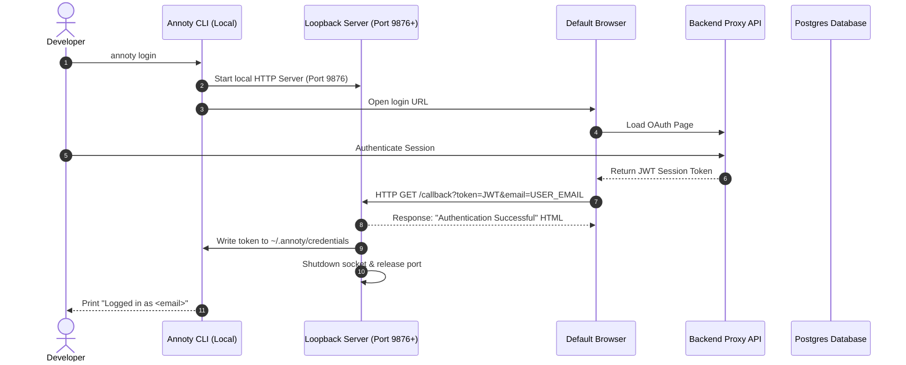

# Annoty CLI

The Annoty CLI (`annoty`) is a developer utility designed to manage visual annotations and codebase instrumentation. It automates local script injection, manages offline/cloud operation modes, and runs diagnostics on your local development workspace.

---

## Technical Architecture

### Authentication Handshake (OAuth Loopback)

The CLI uses the Loopback Interface pattern (RFC 8252) to establish secure local sessions:



* **Dynamic Port Binding:** The local callback server listens on port `9876`. If the port is in use, it sequentially scans and binds up to port `9885`.
* **Lifecycle Constraints:** The server shuts down automatically immediately after receiving the credentials or upon reaching a 2-minute connection timeout.

### Credential Storage & Security

Session tokens are stored in the user's home directory:
* **Path:** `~/.annoty/credentials`
* **Security Model:** On POSIX-compliant systems, files are initialized with `0600` permissions (Owner Read/Write only). On Windows systems, files are saved in the user's secure profile directory (`%USERPROFILE%`).

---

## Multi-Tier Source Mapping

When you select an element in the browser, Annoty resolves its location in the source code using a prioritized lookup hierarchy:

1. **React Fiber (Tier 1):** Resolves JSX node locations (`_debugSource` properties containing file, line, and column numbers) from the DOM instance in development mode.
2. **Framework Native (Tier 2):** Parses Vue VNodes, Svelte metadata (`__svelte_meta`), or compiler-injected Astro attributes (`data-astro-source-file`).
3. **Universal Data Attribute (Tier 3):** Inspects the target DOM tree for a `data-annoty-source` attribute (e.g. `data-annoty-source="src/components/Sidebar.tsx:42"`).
4. **Normalized CSS Selector (Tier 4):** Compiles a resilient CSS selector path combined with parent landmark contexts (such as `<main>` or `<nav>`) as a fallback.

---

## Command Reference

### `login`

Authenticates the local CLI session.

```bash
annoty login [options]
```

* **Options:**
  * `-d, --dashboard <url>`: Override the default API target URL (useful for custom endpoints or staging environments).

---

### `logout`

Clears local configurations and deletes the active session token.

```bash
annoty logout
```

---

### `init`

Instruments the current project directory for overlay usage.

```bash
annoty init
```

* **Idempotence:** Scans your HTML entry point and replaces existing Annoty tags inline instead of appending duplicate elements.
* **Offline Fallback:** If you are logged out, `init` configures the project in **Local-Only Mode**, copying `overlay.js` and injecting the script tag without sync tokens.

---

### `status`

Inspects the current workspace and reports active configuration metrics.

```bash
annoty status
```

* **Output Metrics:**
  * Active Authentication Status
  * Active Sync Mode (Local-Only vs. Cloud Sync)
  * HTML Entry Point Injection State
  * Local Asset Compilation Verification

---

### `doctor`

Runs environment and dependency diagnostics.

```bash
annoty doctor
```

* **Diagnostics Performed:**
  * Verifies Node.js execution environment meets the `>= v18` requirement.
  * Validates the loopback loop port availability (`9876`).
  * Confirms whether `@annoty/overlay` resolves correctly within the workspace dependencies.

---

### `clean`

Removes all development code attributes and assets. Run this command before building production assets or completing code reviews.

```bash
annoty clean
```

* **Actions:**
  * Deletes the local compiled `public/overlay.js` script asset.
  * Strips all Annoty script tags from the project's HTML entry point.

---

### `groups`

Lists all synchronized annotation groups.

```bash
annoty groups
```

*Note: In Local-Only mode, this command is bypassed since all active group data is stored in the browser's LocalStorage.*

---

### `uninstall`

Wipes the local system configuration.

```bash
annoty uninstall
```

* **Actions:**
  * Deletes the global configuration folder `~/.annoty/`.
  * Logs instructions for clean package removal from the global npm registry.

---

## Troubleshooting

### Dynamic caching conflicts in `npx`
* **Symptom:** `npx` runs an outdated version of the package.
* **Resolution:** Clear execution caches by targeting the latest package explicitly:
  ```bash
  npx annoty@latest <command>
  ```

### Loopback port conflicts
* **Symptom:** CLI fails with `Could not find an available port in the range 9876-9885`.
* **Resolution:** Close running development servers blocking ports `9876` through `9885` and re-run `login`.
